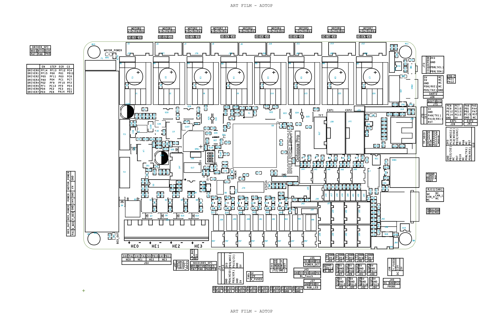

# Electronic Schematics

This folder contains the electronic wiring documentation for the Pellet DispensoMixer V2.

The electronic system is based on a **BIGTREETECH Octopus Pro V1.1** main control board, **A4988 stepper motor drivers**, **NEMA 17 stepper motors**, an external power supply, and an **ST-LINK/V2** programmer for SWD programming.

The objective of this documentation is to make the electronic assembly easier to reproduce, inspect, modify, and maintain.

---

## Files Included

| File                           | Description                                           |
| ------------------------------ | ----------------------------------------------------- |
| `btt_octopus_pro_1.0_pins.png` | Reference pinout of the BIGTREETECH Octopus Pro board |
| `Electronic Schematic (1).png` | General wiring diagram for the NEMA 17 stepper motors |
| `Referencia St link v2.jpg`    | ST-LINK/V2 pinout reference                           |
| `Untitled.png`                 | ST-LINK/V2 to Octopus Pro SWD wiring diagram          |

---

## System Architecture

The electronics are centralized around the **BIGTREETECH Octopus Pro V1.1**, which acts as the main control board for the complete dispensing system.

```text
Power Supply
      │
      ▼
BIGTREETECH Octopus Pro V1.1
      │
      ├── A4988 Driver 1 ── NEMA 17 Motor 1
      ├── A4988 Driver 2 ── NEMA 17 Motor 2
      ├── A4988 Driver 3 ── NEMA 17 Motor 3
      ├── A4988 Driver 4 ── NEMA 17 Motor 4
      ├── A4988 Driver 5 ── NEMA 17 Motor 5
      ├── A4988 Driver 6 ── NEMA 17 Motor 6
      ├── A4988 Driver 7 ── NEMA 17 Motor 7
      └── A4988 Driver 8 ── NEMA 17 Motor 8
```

This architecture simplifies the wiring compared with the previous version of the system, since all motor control is handled from a single main board.

---

## Main Components

| Component                    | Function                                     |
| ---------------------------- | -------------------------------------------- |
| BIGTREETECH Octopus Pro V1.1 | Main control board                           |
| A4988 stepper motor drivers  | Motor driver modules                         |
| NEMA 17 stepper motors       | Actuation of the dispensing modules          |
| External power supply        | Power input for the control board and motors |
| ST-LINK/V2                   | SWD programming and debugging interface      |

---

## Power Connection

The external power supply is connected to the main power input of the Octopus Pro board.

| Power Supply    | Octopus Pro Connection |
| --------------- | ---------------------- |
| Positive output | `POWER +` / `VIN +`    |
| Negative output | `POWER -` / `GND`      |

Before powering the system, check:

* Correct polarity of the power input.
* Correct voltage level for the board and motor drivers.
* Correct motor power jumper configuration.
* No loose wires or accidental short circuits.

Do not power the board if the polarity or voltage configuration is uncertain.

---

## Stepper Driver Installation

Each **A4988 stepper motor driver** is inserted into one of the driver sockets of the Octopus Pro board.

| Driver         | Board Location        |
| -------------- | --------------------- |
| A4988 Driver 1 | Motor driver socket 1 |
| A4988 Driver 2 | Motor driver socket 2 |
| A4988 Driver 3 | Motor driver socket 3 |
| A4988 Driver 4 | Motor driver socket 4 |
| A4988 Driver 5 | Motor driver socket 5 |
| A4988 Driver 6 | Motor driver socket 6 |
| A4988 Driver 7 | Motor driver socket 7 |
| A4988 Driver 8 | Motor driver socket 8 |

Important notes:

* Check the orientation of each A4988 driver before powering the board.
* Do not insert or remove drivers while the board is powered.
* Use heatsinks if the drivers operate for long periods or under high current.
* Adjust the current limit of each driver before continuous operation.

---

## Stepper Motor Connections

Each **NEMA 17 stepper motor** is connected to its corresponding motor output connector on the Octopus Pro board.

| Motor   | Octopus Pro Output |
| ------- | ------------------ |
| Motor 1 | `MOTOR0`           |
| Motor 2 | `MOTOR1`           |
| Motor 3 | `MOTOR2`           |
| Motor 4 | `MOTOR3`           |
| Motor 5 | `MOTOR4`           |
| Motor 6 | `MOTOR5`           |
| Motor 7 | `MOTOR6`           |
| Motor 8 | `MOTOR7`           |

Each motor has two internal coils. Before connecting the motors, identify the coil pairs using a multimeter in continuity mode.

Typical motor wiring:

| Motor Coil    | Board Output |
| ------------- | ------------ |
| Coil A wire 1 | `A1`         |
| Coil A wire 2 | `A2`         |
| Coil B wire 1 | `B1`         |
| Coil B wire 2 | `B2`         |

If a motor vibrates but does not rotate, the coil pairs may be incorrectly connected. If the motor rotates in the opposite direction, reverse the motor direction in firmware or swap one coil pair.

Do not connect or disconnect stepper motors while the board is powered.

---

## ST-LINK/V2 Programming Connection

The Octopus Pro can be programmed or debugged through its SWD connector using an **ST-LINK/V2** programmer.

The SWD connector on the Octopus Pro is labelled as:

```text
3V3 | SWDIO | GND | SWCLK | RST
```

Recommended ST-LINK/V2 to Octopus Pro connection:

| ST-LINK/V2 20-pin Connector | Signal                             | Octopus Pro SWD Connector |
| --------------------------- | ---------------------------------- | ------------------------- |
| Pin 1                       | `VCCIN` / target voltage reference | `3V3`                     |
| Pin 7                       | `TMS` / `SWDIO`                    | `SWDIO`                   |
| Pin 9                       | `TCK` / `SWCLK`                    | `SWCLK`                   |
| Pin 15                      | `NRST`                             | `RST`                     |
| Pin 4 or any GND pin        | `GND`                              | `GND`                     |

The `RST` connection is optional for basic SWD communication, but it is recommended because it allows the programmer to connect using hardware reset if needed.

Minimum 4-wire SWD connection:

```text
ST-LINK VCCIN / VAPP  →  Octopus 3V3
ST-LINK GND           →  Octopus GND
ST-LINK SWDIO         →  Octopus SWDIO
ST-LINK SWCLK         →  Octopus SWCLK
```

Recommended 5-wire SWD connection:

```text
ST-LINK VCCIN / VAPP  →  Octopus 3V3
ST-LINK GND           →  Octopus GND
ST-LINK SWDIO         →  Octopus SWDIO
ST-LINK SWCLK         →  Octopus SWCLK
ST-LINK NRST          →  Octopus RST
```

Important notes:

* Do not connect 5 V to the Octopus SWD connector.
* The `3V3` connection is used as a voltage reference for the ST-LINK.
* The Octopus Pro should be powered through USB-C or its normal power input.
* Use SWD mode in STM32CubeProgrammer.
* If the board is not detected, try a lower SWD frequency and use `Connect under reset`.

---

## Suggested Cable Color Code

| Signal                    | Recommended Color |
| ------------------------- | ----------------- |
| `3V3` / voltage reference | Red               |
| `GND`                     | Black             |
| `SWDIO`                   | Blue              |
| `SWCLK`                   | Yellow            |
| `RST`                     | Green             |

This color code is recommended to reduce wiring mistakes during programming and debugging.

---

## Electronics Assembly Procedure

1. Verify that the Octopus Pro board is powered off.
2. Insert the A4988 stepper motor drivers into the driver sockets.
3. Check the orientation of every A4988 driver.
4. Connect each NEMA 17 motor to its corresponding motor output.
5. Verify the coil pairs of each motor before powering the system.
6. Connect the external power supply to the Octopus Pro power input.
7. Connect the ST-LINK/V2 to the SWD connector if firmware programming is required.
8. Power the board and verify that no driver overheats.
9. Test each motor individually before running the full dispensing sequence.
10. If a motor moves in the wrong direction, correct the direction in firmware or swap one coil pair.

---

## Safety Notes

* Always disconnect power before modifying the wiring.
* Do not connect or disconnect motors while the board is powered.
* Do not insert or remove stepper drivers while the board is powered.
* Check the current limit of each A4988 driver before long operation.
* Verify power supply voltage and polarity before testing.
* Keep the board on a non-conductive surface during initial tests.
* If any component becomes excessively hot, power off the system immediately.

---

## Reference Images

### Octopus Pro Pinout



### Motor Wiring Diagram


### ST-LINK/V2 Pinout Reference


### ST-LINK to Octopus Pro Wiring


